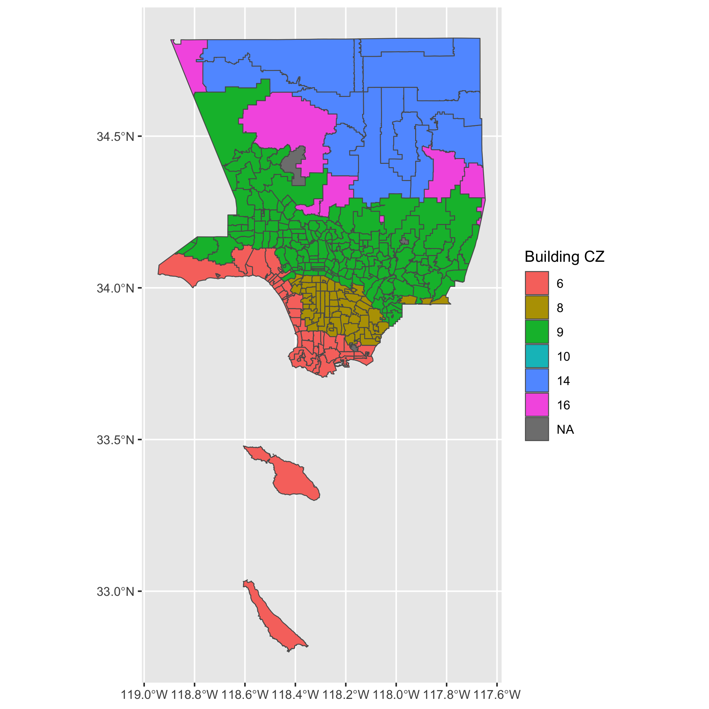

```{r setup, include=FALSE}
knitr::opts_chunk$set(echo = FALSE, message = FALSE, warning=FALSE)
knitr::opts_knit$set(root.dir = "~/Dropbox/workLBNL/EESA/AH_LA_AnalysisPaper/rmd/")
```

```{r helpers, message=FALSE, eval=TRUE}
library("dplyr")
## load data sets
devtools::load_all("../AH.Analysis", export_all = FALSE)
```

<!-- # Climate zone in LA county -->

<!--  -->

# Before retrofit

## Annual total AH and energy using prototype model of the six different climate zones

```{r originalFileAH, fig.show='hold', fig.width=10, eval=TRUE}
plot.type = "test_cz_6"

p1 <- residential.annual.total.airport %>%
  dplyr::mutate(cz = factor(as.numeric(cz))) %>%
  dplyr::filter(scenario == "") %>%
  dplyr::select(-starts_with("energy")) %>%
  tidyr::gather(variable, GJ, emission.exfiltration:emission.overall) %>%
  dplyr::mutate(vintage = factor(vintage, levels = c("pre-1980", "2004", "2013", "2019"))) %>%
  dplyr::mutate(variable = factor(variable, levels=c("emission.exfiltration"
                                                   , "emission.exhaust"
                                                   , "emission.ref"
                                                   , "emission.rej"
                                                   , "emission.surf"
                                                   , "emission.overall"))) %>%
  {.}

if (plot.type == "test") {
  p1 <- p1 %>%
    ggplot2::ggplot(ggplot2::aes(x = vintage, y = GJ, fill = cz, group = interaction(building.type, variable, cz, vintage))) +
    ggplot2::geom_bar(stat="identity", position="dodge") +
    ggplot2::facet_grid(building.type~variable, scales="free_y") +
    ggplot2::ggtitle("Annual total AH for different climate zone") +
    ggplot2::ylab("Total AH (GJ)") +
    ggplot2::theme()
} else if (plot.type == "test_cz_6") {
  p1 <- p1 %>%
    ggplot2::ggplot(ggplot2::aes(x = vintage, y = GJ, fill = vintage, group = interaction(building.type, variable, vintage))) +
    ggplot2::geom_bar(stat="identity", position="dodge") +
    ggplot2::facet_grid(building.type~variable, scales="free_y") +
    ggplot2::ggtitle("Annual total AH for climate zone 6") +
    ggplot2::ylab("Total AH (GJ)") +
    ggplot2::theme()
}

print(p1)

p2 <- residential.annual.total.airport %>%
  dplyr::mutate(cz = factor(as.numeric(cz))) %>%
  dplyr::filter(scenario == "") %>%
  dplyr::select(-starts_with("emission")) %>%
  tidyr::gather(variable, GJ, energy.elec:energy.gas) %>%
  dplyr::mutate(vintage = factor(vintage, levels = c("pre-1980", "2004", "2013", "2019"))) %>%
  dplyr::mutate(variable = factor(variable, levels=c("energy.elec" ,
                                                     "energy.gas" ,
                                                     "energy.overall"))) %>%
  {.}

if (plot.type == "test") {
  p2 <- p2 %>%
    ggplot2::ggplot(ggplot2::aes(x = vintage, y = GJ, fill = cz, group = interaction(building.type, variable, cz, vintage))) +
    ggplot2::geom_bar(stat="identity", position="dodge") +
    ggplot2::facet_grid(building.type~variable, scales="free_y") +
    ggplot2::ggtitle("Annual total electricity + gas for different climate zone") +
    ggplot2::ylab("Total electricity + gas (GJ)") +
    ggplot2::theme()
} else if (plot.type == "test_cz_6") {
  p2 <- p2 %>%
    ggplot2::ggplot(ggplot2::aes(x = vintage, y = GJ, fill=vintage, group = interaction(building.type, variable, vintage))) +
    ggplot2::geom_bar(stat="identity", position="dodge") +
    ggplot2::facet_grid(building.type~variable, scales="free_y") +
    ggplot2::ggtitle("Annual total electricity + gas for climate zone 6") +
    ggplot2::ylab("Total electricity + gas (GJ)") +
    ggplot2::theme()
}

print(p2)

```

## Monthly total AH and energy using prototype model of the six different climate zones

```{r originalFileEnergy, fig.show='hold', fig.width=10, eval=TRUE}
## fixme: get energy here
to.plot <- residential.monthly.total.airport %>%
  dplyr::mutate(cz = factor(as.numeric(cz))) %>%
  dplyr::filter(scenario == "") %>%
  tidyr::gather(variable, GJ, emission.exfiltration:energy.gas) %>%
  dplyr::mutate(GJ = GJ * 1e-9) %>%
  {.}

variables = unique(to.plot$variable)

if (plot.type == "test") {
  for (var in variables) {
    p <- to.plot %>%
      dplyr::filter(variable == var) %>%
      dplyr::mutate(vintage = factor(vintage, levels = c("pre-1980", "2004", "2013", "2019"))) %>%
      ggplot2::ggplot(ggplot2::aes(x = month, y = GJ, color = cz, group = interaction(variable, vintage, cz))) +
      ggplot2::geom_line() +
      ggplot2::facet_grid(building.type~vintage) +
      ggplot2::ggtitle(sprintf("Monthly AH %s", var)) +
      ggplot2::ylab("GJ") +
      ggplot2::theme()
    print(p)
  }
} else {
  for (var in variables) {
    p <- to.plot %>%
      dplyr::filter(variable == var) %>%
      dplyr::mutate(vintage = factor(vintage, levels = c("pre-1980", "2004", "2013", "2019"))) %>%
      ggplot2::ggplot(ggplot2::aes(x = month, y = GJ, color = vintage, group = interaction(variable, vintage))) +
      ggplot2::geom_line() +
      ggplot2::facet_wrap(.~building.type) +
      ggplot2::ggtitle(sprintf("Monthly AH %s", var)) +
      ggplot2::ylab("GJ") +
      ggplot2::theme()
    print(p)
  }
}
```

# Before vs after retrofit for climate zone 6

```{r cmpScenario, fig.show='hold', fig.width=10, eval=TRUE}
no.scenario.long = residential.annual.total.airport %>%
  dplyr::filter(scenario == "") %>%
  dplyr::filter(vintage != "2019") %>%
  dplyr::select(-scenario) %>%
  tidyr::gather(variable, GJ.before, emission.exfiltration:energy.gas) %>%
  {.}

with.scenrio.long = residential.annual.total.airport %>%
  dplyr::filter(scenario != "") %>%
  dplyr::filter(vintage != "2019") %>%
  tidyr::gather(variable, GJ.after, emission.exfiltration:energy.gas) %>%
  {.}

to.plot.annual <- no.scenario.long %>%
  dplyr::left_join(with.scenrio.long, by = c("building.type", "vintage", "cz", "variable")) %>%
  tidyr::gather(status, GJ, c(GJ.before, GJ.after)) %>%
  dplyr::mutate(status = gsub("GJ.", "", status)) %>%
  {.}

to.plot.annual.change <- no.scenario.long %>%
  dplyr::left_join(with.scenrio.long, by = c("building.type", "vintage", "cz", "variable")) %>%
  dplyr::mutate(diff = GJ.after - GJ.before,
                percent.diff = (GJ.after - GJ.before) / GJ.before * 100) %>%
  dplyr::mutate(cz = as.numeric(cz)) %>%
  dplyr::mutate(vintage = factor(vintage, levels = c("pre-1980", "2004", "2013"))) %>%
  dplyr::mutate(scenario = factor(scenario, levels = c("CoolingCoilCOP", "envelope", "Lighting70", "HeatPump", "infiltration"))) %>%
  dplyr::mutate(variable = factor(variable, levels=c("emission.exfiltration",
                                                     "emission.exhaust",
                                                     "emission.ref",
                                                     "emission.rej" ,
                                                     "emission.surf" ,
                                                     "emission.overall",
                                                     "energy.elec",
                                                     "energy.gas",
                                                     "energy.overall"))) %>%
  {.}

climate.zones = sort(unique(to.plot.annual.change$cz))

for (climate.zone in climate.zones) {
  for(plot.type in c("emission", "energy")) {
    p <- to.plot.annual %>%
      dplyr::filter(cz == climate.zone, stringr::str_detect(variable, plot.type)) %>%
      ggplot2::ggplot(ggplot2::aes(x = vintage, y = GJ, fill = scenario, group = interaction(building.type, vintage, variable, scenario))) +
      ggplot2::geom_bar(stat="identity", position="dodge") +
      ggplot2::facet_grid(building.type~variable) +
      ggplot2::ggtitle(sprintf("Annual %s GJ change for different upgrades, climate zone %s", plot.type, climate.zone)) +
      ggplot2::ylab("GJ") +
      ggplot2::theme()
    print(p)
  }
}

for (climate.zone in climate.zones) {
  for(plot.type in c("emission", "energy")) {
    p <- to.plot.annual.change %>%
      dplyr::filter(cz == climate.zone, stringr::str_detect(variable, plot.type)) %>%
      ggplot2::ggplot(ggplot2::aes(x = vintage, y = percent.diff, fill = scenario, group = interaction(building.type, vintage, variable, scenario))) +
      ggplot2::geom_bar(stat="identity", position="dodge") +
      ggplot2::facet_grid(building.type~variable) +
      ggplot2::ggtitle(sprintf("Annual %s percent change for different upgrades, climate zone %s", plot.type, climate.zone)) +
      ggplot2::ylab("GJ") +
      ggplot2::theme()
    print(p)
  }
}
```

## Diurnal Profile
```{r diurnal, fig.show='hold', fig.width=10, eval=TRUE}
to.plot.diurnal <- residential.month.hour.mean.airport %>%
  dplyr::mutate(cz = factor(as.numeric(cz))) %>%
  tidyr::gather(variable, value, emission.exfiltration:energy.gas) %>%
  dplyr::mutate(MJ = value * 1e-6) %>%
  dplyr::select(-value) %>%
  dplyr::mutate(vintage = factor(vintage, levels = c("pre-1980", "2004", "2013", "2019"))) %>%
  {.}

if (plot.type == "test") {
  for (mon in c("07", "01")) {
    for (var in variables) {
      p <- to.plot.diurnal %>%
        dplyr::filter(month == "07", variable == var) %>%
        ggplot2::ggplot(ggplot2::aes(x = hour, y = MJ, color = cz, group = interaction(scenario, building.type, vintage, cz))) +
        ggplot2::geom_line() +
        ggplot2::facet_grid(building.type~vintage) +
        ggplot2::ggtitle(sprintf("Hourly %s for month %s", var, mon)) +
        ggplot2::ylab("MJ") +
        ggplot2::theme()
      print(p)
    }
  }
} else {
  for (mon in c("07", "01")) {
    for (var in variables) {
      p <- to.plot.diurnal %>%
        dplyr::filter(month == "07", variable == var) %>%
        ggplot2::ggplot(ggplot2::aes(x = hour, y = MJ, color = scenario, group = interaction(scenario, building.type, vintage, cz))) +
        ggplot2::geom_line() +
        ggplot2::facet_grid(building.type~vintage) +
        ggplot2::ggtitle(sprintf("Hourly %s for month %s", var, mon)) +
        ggplot2::ylab("MJ") +
        ggplot2::theme()
      print(p)
    }
  }
}
```
